# Can't be RSS'd 1 and NoEmulatorsPlz

These challenges were reused from a past Hackfest CTF (2024?). I completed `Can't be RSS'd 1` very late during the CTF and then continued on with the `NoEmulatorsPlz` challenges after the fact. I have been working for a couple of months with Android development at work and I wanted to learn and verify my learnings as well.

### Can't be RSS'd 1 (75)

The mention of the "2 flags" below is because there was another related challenge with the same file that required web exploitation/stego but I didn't do it.

Challenge description:
```
Oh no, my HFortune Card reader is broken! Can you fix it? (There will be 2 flags in total.)
```

Hint:
```
Found something, but can't resolve? Add a dot in the right place! (And/or dm me to double-check :) )
```

Challenge file:
* [HFCardReading.apk](HFCardReading.apk)

Using [`jadx`](https://github.com/skylot/jadx) we'll start with:

```console
$ jadx-gui HFCardReading.apk
```

We first look at `AndroidManifest.xml` for the entry point of the app, which is found to be `io.mmsec.hfcardreading.MainActivity`:
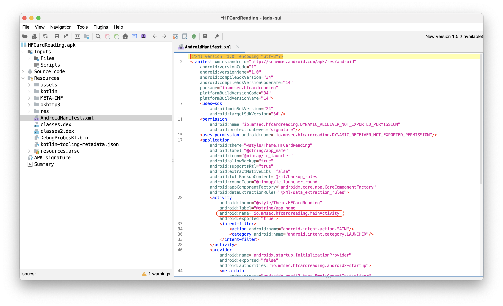

We look at the code of that function to find this at the bottom:
`this$0.pageLoader.loadPage(seeCardWebView, "https://rssfeed.challengeshfctf.ca/rss/hf.xml");`:
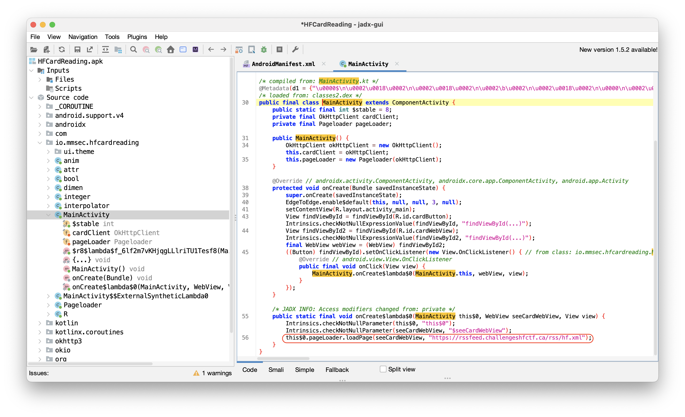

Following the hint above, we add a missing dot between the words `challenges` and `hfctf` which gives us this link:
https://rssfeed.challenges.hfctf.ca/rss/hf.xml

The flag is available in the XML code found at that link.

### NoEmulatorsPlz 1 (100)

Challenge description:
```
This app only runs on original HF Devices! (There will be 3 flags in total.)
```

Challenge file:
* [NoEmulatorsPlz.apk](NoEmulatorsPlz.apk)

Similarly to the previous challenge, we'll use [`jadx`](https://github.com/skylot/jadx):
```console
$ jadx-gui NoEmulatorsPlz.apk
```

We find the entry point of the app which is this function: `io.mmsec.hfnoemulatorsplz.MainActivity`:
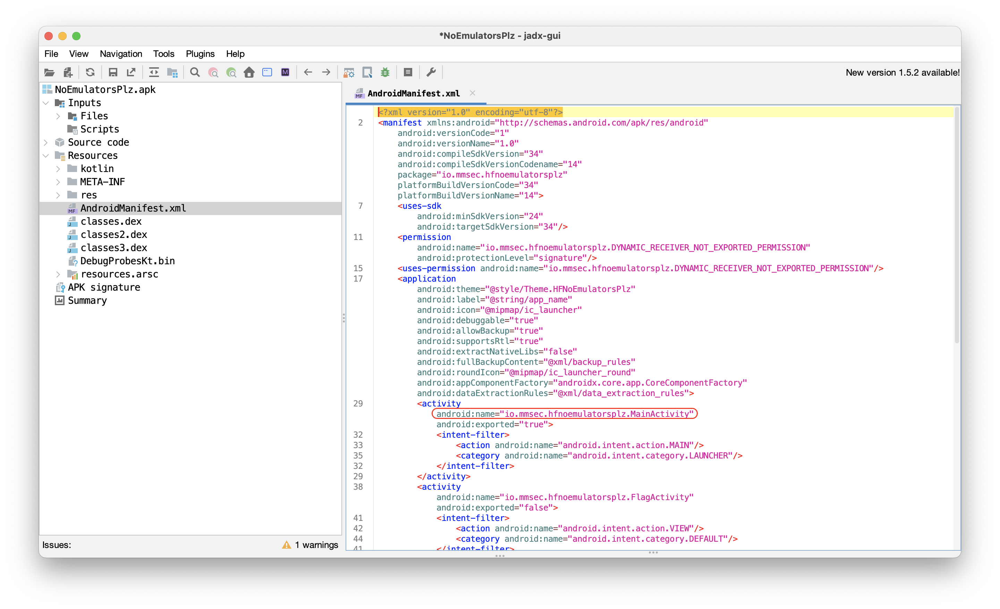

We save `AndroidManifest.xml` here to reference it later:
```xml
<?xml version="1.0" encoding="utf-8"?>
<manifest xmlns:android="http://schemas.android.com/apk/res/android"
    android:versionCode="1"
    android:versionName="1.0"
    android:compileSdkVersion="34"
    android:compileSdkVersionCodename="14"
    package="io.mmsec.hfnoemulatorsplz"
    platformBuildVersionCode="34"
    platformBuildVersionName="14">
    <uses-sdk
        android:minSdkVersion="24"
        android:targetSdkVersion="34"/>
    <permission
        android:name="io.mmsec.hfnoemulatorsplz.DYNAMIC_RECEIVER_NOT_EXPORTED_PERMISSION"
        android:protectionLevel="signature"/>
    <uses-permission android:name="io.mmsec.hfnoemulatorsplz.DYNAMIC_RECEIVER_NOT_EXPORTED_PERMISSION"/>
    <application
        android:theme="@style/Theme.HFNoEmulatorsPlz"
        android:label="@string/app_name"
        android:icon="@mipmap/ic_launcher"
        android:debuggable="true"
        android:allowBackup="true"
        android:supportsRtl="true"
        android:extractNativeLibs="false"
        android:fullBackupContent="@xml/backup_rules"
        android:roundIcon="@mipmap/ic_launcher_round"
        android:appComponentFactory="androidx.core.app.CoreComponentFactory"
        android:dataExtractionRules="@xml/data_extraction_rules">
        <activity
            android:name="io.mmsec.hfnoemulatorsplz.MainActivity"
            android:exported="true">
            <intent-filter>
                <action android:name="android.intent.action.MAIN"/>
                <category android:name="android.intent.category.LAUNCHER"/>
            </intent-filter>
        </activity>
        <activity
            android:name="io.mmsec.hfnoemulatorsplz.FlagActivity"
            android:exported="false">
            <intent-filter>
                <action android:name="android.intent.action.VIEW"/>
                <category android:name="android.intent.category.DEFAULT"/>
            </intent-filter>
        </activity>
        <provider
            android:name="androidx.startup.InitializationProvider"
            android:exported="false"
            android:authorities="io.mmsec.hfnoemulatorsplz.androidx-startup">
            <meta-data
                android:name="androidx.emoji2.text.EmojiCompatInitializer"
                android:value="androidx.startup"/>
            <meta-data
                android:name="androidx.lifecycle.ProcessLifecycleInitializer"
                android:value="androidx.startup"/>
            <meta-data
                android:name="androidx.profileinstaller.ProfileInstallerInitializer"
                android:value="androidx.startup"/>
        </provider>
        <receiver
            android:name="androidx.profileinstaller.ProfileInstallReceiver"
            android:permission="android.permission.DUMP"
            android:enabled="true"
            android:exported="true"
            android:directBootAware="false">
            <intent-filter>
                <action android:name="androidx.profileinstaller.action.INSTALL_PROFILE"/>
            </intent-filter>
            <intent-filter>
                <action android:name="androidx.profileinstaller.action.SKIP_FILE"/>
            </intent-filter>
            <intent-filter>
                <action android:name="androidx.profileinstaller.action.SAVE_PROFILE"/>
            </intent-filter>
            <intent-filter>
                <action android:name="androidx.profileinstaller.action.BENCHMARK_OPERATION"/>
            </intent-filter>
        </receiver>
    </application>
</manifest>
```

Next, we're looking at the source code of this activity:
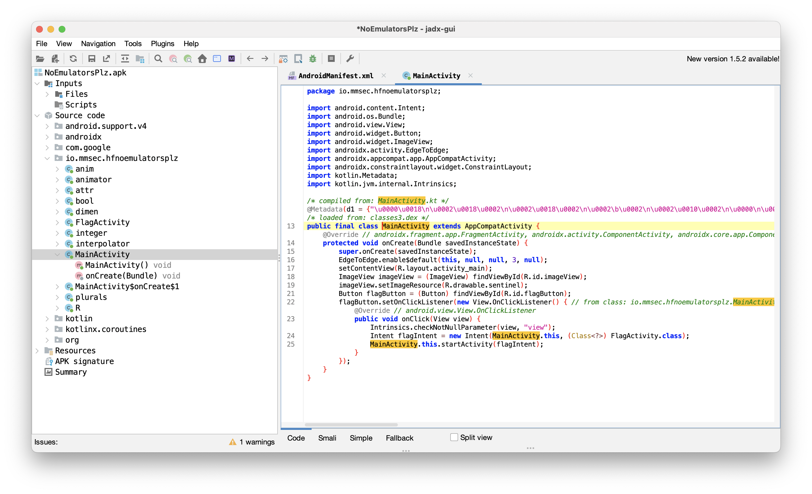

We can see a few interesting things in this code without having to launch the app in an emulator:
```java
public final class MainActivity extends AppCompatActivity {
    @Override // androidx.fragment.app.FragmentActivity, androidx.activity.ComponentActivity, androidx.core.app.ComponentActivity, android.app.Activity
    protected void onCreate(Bundle savedInstanceState) {
        super.onCreate(savedInstanceState);
        EdgeToEdge.enable$default(this, null, null, 3, null);
        setContentView(R.layout.activity_main);
        ImageView imageView = (ImageView) findViewById(R.id.imageView);
        imageView.setImageResource(R.drawable.sentinel);
        Button flagButton = (Button) findViewById(R.id.flagButton);
        flagButton.setOnClickListener(new View.OnClickListener() { // from class: io.mmsec.hfnoemulatorsplz.MainActivity$onCreate$1
            @Override // android.view.View.OnClickListener
            public void onClick(View view) {
                Intrinsics.checkNotNullParameter(view, "view");
                Intent flagIntent = new Intent(MainActivity.this, (Class<?>) FlagActivity.class);
                MainActivity.this.startActivity(flagIntent);
            }
        });
    }
}
```

With these 2 lines,
```java
ImageView imageView = (ImageView) findViewById(R.id.imageView);
imageView.setImageResource(R.drawable.sentinel);
```
we can probably expect an image of the Sentinel logo of the Hackfest.

With this line,
```java
Button flagButton = (Button) findViewById(R.id.flagButton);
```
we can expect a button.

Finally, with this block,
```java
flagButton.setOnClickListener(new View.OnClickListener() { // from class: io.mmsec.hfnoemulatorsplz.MainActivity$onCreate$1
    @Override // android.view.View.OnClickListener
    public void onClick(View view) {
        Intrinsics.checkNotNullParameter(view, "view");
        Intent flagIntent = new Intent(MainActivity.this, (Class<?>) FlagActivity.class);
        MainActivity.this.startActivity(flagIntent);
    }
});
```
we see that a `FlagActivity` is started when we click the above button. Next, let's look at the source code of  `FlagActivity`:
```java
package io.mmsec.hfnoemulatorsplz;

import android.os.Bundle;
import android.util.Log;
import android.widget.TextView;
import androidx.appcompat.app.AppCompatActivity;
import androidx.constraintlayout.widget.ConstraintLayout;
import kotlin.Metadata;
import kotlin.internal.ProgressionUtilKt;
import kotlin.jvm.internal.Intrinsics;

/* compiled from: FlagActivity.kt */
@Metadata(d1 = {"\u0000\u0018\n\u0002\u0018\u0002\n\u0002\u0018\u0002\n\u0002\b\u0002\n\u0002\u0010\u0002\n\u0000\n\u0002\u0018\u0002\n\u0000\u0018\u00002\u00020\u0001B\u0005¢\u0006\u0002\u0010\u0002J\u0012\u0010\u0003\u001a\u00020\u00042\b\u0010\u0005\u001a\u0004\u0018\u00010\u0006H\u0014¨\u0006\u0007"}, d2 = {"Lio/mmsec/hfnoemulatorsplz/FlagActivity;", "Landroidx/appcompat/app/AppCompatActivity;", "()V", "onCreate", "", "savedInstanceState", "Landroid/os/Bundle;", "app_debug"}, k = 1, mv = {1, 9, 0}, xi = ConstraintLayout.LayoutParams.Table.LAYOUT_CONSTRAINT_VERTICAL_CHAINSTYLE)
/* loaded from: classes3.dex */
public final class FlagActivity extends AppCompatActivity {
    @Override // androidx.fragment.app.FragmentActivity, androidx.activity.ComponentActivity, androidx.core.app.ComponentActivity, android.app.Activity
    protected void onCreate(Bundle savedInstanceState) {
        super.onCreate(savedInstanceState);
        setContentView(R.layout.flag_activity);
        String ae = "靘靚靜靛靘靚";
        StringBuilder sb = new StringBuilder();
        String ao = onCreate$obfuscate("非靛靜霉靝静");
        StringBuilder append = sb.append(ao);
        String aa = onCreate$obfuscate("靜霌靘霉靘靚");
        append.append(aa).append(onCreate$obfuscate("靜青靜靟靝靘")).append(onCreate$obfuscate("靜靟靘靝靝静")).append(onCreate$obfuscate("靘靚靜靛靘靚")).append(onCreate$obfuscate("靜靝靜霌靜霌")).append(onCreate$obfuscate("靜非靜靓靜靟")).append(onCreate$obfuscate("靘靚靜靜靜霌")).append(onCreate$obfuscate("靝靘靘靚靝靓")).append(onCreate$obfuscate("靜霌靝靟靘靚")).append(onCreate$obfuscate("靘青靜霋靝靟")).append(onCreate$obfuscate("靝静靝非靘靚")).append(onCreate$obfuscate("靜靛靜非靜非")).append(onCreate$obfuscate("靘靚靝非靜青")).append(onCreate$obfuscate("靜靟靘靚靜青")).append(onCreate$obfuscate("靜靟靜靛靜非")).append(onCreate$obfuscate("靜靟靝靘靘靚")).append(onCreate$obfuscate("靜靛靜霏靜非")).append(onCreate$obfuscate("靘靚靜霉靜靟")).append(onCreate$obfuscate("靜靛靝靜靜靟")).append(onCreate$obfuscate("靘靚靜霌靝靟")).append(onCreate$obfuscate("靝非靘靚靝非")).append(onCreate$obfuscate("靜青靜靟靘靚"));
        sb.append(onCreate$obfuscate("靝静靝靚靜靛")).append(onCreate$obfuscate("靜静靜靟靝静")).append(onCreate$obfuscate("靘靓静霋靘靚")).append(onCreate$obfuscate("静靜靜靜靜静")).append(onCreate$obfuscate("静靚靘靚静非")).append(onCreate$obfuscate("靜靛静非靜靘")).append(onCreate$obfuscate("靘靚靜静静靜")).append(onCreate$obfuscate("静靝靜靘靘靚")).append(onCreate$obfuscate("靜静静靟静青")).append(onCreate$obfuscate("静靘靘靚静静")).append(onCreate$obfuscate("静靜静靘静靜")).append(onCreate$obfuscate("靘靚静靚靜靛")).append(onCreate$obfuscate("静靚靜靜靘靚")).append(onCreate$obfuscate("静靝静靝静靚")).append(onCreate$obfuscate("静靓靘靚靜靟")).append(onCreate$obfuscate("静靝靜静靜非"));
        String compareString = sb.toString();
        String encodedText1 = compareString;
        StringBuilder decodedText1 = new StringBuilder();
        int i = 0;
        int progressionLastElement = ProgressionUtilKt.getProgressionLastElement(0, encodedText1.length() - 1, 2);
        if (0 <= progressionLastElement) {
            while (true) {
                String hexPair = encodedText1.substring(i, i + 2);
                Intrinsics.checkNotNullExpressionValue(hexPair, "this as java.lang.String…ing(startIndex, endIndex)");
                String encodedText12 = encodedText1;
                String ae2 = ae;
                int asciiValue = Integer.parseInt(hexPair, 16);
                decodedText1.append((char) asciiValue);
                if (i == progressionLastElement) {
                    break;
                }
                i += 2;
                encodedText1 = encodedText12;
                ae = ae2;
            }
        }
        StringBuilder sb2 = new StringBuilder();
        sb2.append(onCreate$obfuscate("非青靜靟")).append(onCreate$obfuscate("靝靘靜靟")).append(onCreate$obfuscate("靘靚靜靓")).append(onCreate$obfuscate("靝静靘靚")).append(onCreate$obfuscate("靝靓靜霌")).append(onCreate$obfuscate("靝靟靝靘")).append(onCreate$obfuscate("靘靚靜靜")).append(onCreate$obfuscate("靜霉靜靛")).append(onCreate$obfuscate("靜靝靘靛")).append(onCreate$obfuscate("靘靚非霋")).append(onCreate$obfuscate("靝靟靝静")).append(onCreate$obfuscate("靝非靘靚")).append(onCreate$obfuscate("靜靛靜非")).append(onCreate$obfuscate("靜非靘靚")).append(onCreate$obfuscate("靝非靜青")).append(onCreate$obfuscate("靜靟靘靚")).append(onCreate$obfuscate("靜青靜靟")).append(onCreate$obfuscate("靜靛靜非")).append(onCreate$obfuscate("靜靟靝靘")).append(onCreate$obfuscate("靘靚靜靛")).append(onCreate$obfuscate("靜霏靜非")).append(onCreate$obfuscate("靘靚靜霉")).append(onCreate$obfuscate("靜靟靜靛"));
        sb2.append(onCreate$obfuscate("靝靜靜靟")).append(onCreate$obfuscate("靘靚靜霌")).append(onCreate$obfuscate("靝靟靝非")).append(onCreate$obfuscate("靘靚靝非")).append(onCreate$obfuscate("靜青靜靟")).append(onCreate$obfuscate("靘靚靝静")).append(onCreate$obfuscate("靝靚靜靛")).append(onCreate$obfuscate("靜静靜靟")).append(onCreate$obfuscate("靝静静霋")).append(onCreate$obfuscate("靘靚静靜")).append(onCreate$obfuscate("静靘静靜")).append(onCreate$obfuscate("靜靘靘靚")).append(onCreate$obfuscate("靜静靜靛")).append(onCreate$obfuscate("靜靛靜靟")).append(onCreate$obfuscate("靘靚靜靟")).append(onCreate$obfuscate("静靛静靘")).append(onCreate$obfuscate("静靘靘靚")).append(onCreate$obfuscate("静靝靜静")).append(onCreate$obfuscate("静非静靜")).append(onCreate$obfuscate("靘靚靜靜")).append(onCreate$obfuscate("静非静静")).append(onCreate$obfuscate("靜靜靘靚")).append(onCreate$obfuscate("靜靘静靜"));
        sb2.append(onCreate$obfuscate("静非靜非")).append(onCreate$obfuscate("靘靚靜靜")).append(onCreate$obfuscate("静靛靜靘")).append(onCreate$obfuscate("靜靛靘靚")).append(onCreate$obfuscate("静静静青")).append(onCreate$obfuscate("靜靛靜靟"));
        String compareString2 = sb2.toString();
        String encodedText2 = compareString2;
        StringBuilder decodedText2 = new StringBuilder();
        int i2 = 0;
        int progressionLastElement2 = ProgressionUtilKt.getProgressionLastElement(0, encodedText2.length() - 1, 2);
        if (0 <= progressionLastElement2) {
            while (true) {
                String hexPair2 = encodedText2.substring(i2, i2 + 2);
                Intrinsics.checkNotNullExpressionValue(hexPair2, "this as java.lang.String…ing(startIndex, endIndex)");
                String encodedText22 = encodedText2;
                int asciiValue2 = Integer.parseInt(hexPair2, 16);
                decodedText2.append((char) asciiValue2);
                if (i2 == progressionLastElement2) {
                    break;
                }
                i2 += 2;
                encodedText2 = encodedText22;
            }
        }
        String compareString3 = onCreate$obfuscate("靘霈靜青靜靟靜靛") + onCreate$obfuscate("靜非靜靟靝靘靘靚") + onCreate$obfuscate("靘霎靝静靝靚靜靛") + onCreate$obfuscate("靜静靜靟靝静靘霉") + onCreate$obfuscate("靘靚靝靓靜霌靝靟") + onCreate$obfuscate("靘靚靜霈靜霏靜霌") + onCreate$obfuscate("靝靝靘靚靝非靜青") + onCreate$obfuscate("靜靟靘靚靜非靝靘") + onCreate$obfuscate("靜靓靜霉靜霉静霋") + onCreate$obfuscate("靘靚静青静静静靟") + onCreate$obfuscate("静靘靘靚靜非靜靘") + onCreate$obfuscate("静靝静非靘靚静非") + onCreate$obfuscate("靜非静靘靜靟靘靚") + onCreate$obfuscate("靜非静靟静靚靜靛") + onCreate$obfuscate("靘靚靜静靜靘靜靛") + onCreate$obfuscate("靜靜靘靚静非靜静") + onCreate$obfuscate("静靜静靚靘靚靜靟") + onCreate$obfuscate("静靛静非靜靜靘靚") + onCreate$obfuscate("靜静静靛静青静靝");
        String encodedText3 = compareString3;
        StringBuilder decodedText3 = new StringBuilder();
        int i3 = 0;
        int progressionLastElement3 = ProgressionUtilKt.getProgressionLastElement(0, encodedText3.length() - 1, 2);
        if (0 <= progressionLastElement3) {
            while (true) {
                String hexPair3 = encodedText3.substring(i3, i3 + 2);
                Intrinsics.checkNotNullExpressionValue(hexPair3, "this as java.lang.String…ing(startIndex, endIndex)");
                String encodedText32 = encodedText3;
                int asciiValue3 = Integer.parseInt(hexPair3, 16);
                decodedText3.append((char) asciiValue3);
                if (i3 == progressionLastElement3) {
                    break;
                }
                i3 += 2;
                encodedText3 = encodedText32;
            }
        }
        TextView textView = (TextView) findViewById(R.id.text_view);
        Log.d("Custom flag properties", "Custom flag set successfully! " + ((Object) decodedText1));
        String isHFEmulator = System.getProperty("debug.customflag", "");
        System.setProperty("debug.secretkey", String.valueOf(decodedText3));
        Log.d("Custom flag properties", "Custom flag set successfully!");
        if (Intrinsics.areEqual(isHFEmulator, "originalHFEmulator")) {
            textView.setText(String.valueOf(decodedText2));
        } else {
            textView.setText("Sorry, the app needs to run on an original HF device to display the flag.");
        }
    }

    private static final String onCreate$obfuscate(String input) {
        StringBuilder result = new StringBuilder();
        int length = input.length();
        for (int i = 0; i < length; i++) {
            char c = input.charAt(i);
            char r = (char) (c ^ 38762);
            result.append(r);
        }
        String sb = result.toString();
        Intrinsics.checkNotNullExpressionValue(sb, "toString(...)");
        return sb;
    }
}
```

Most of it seems to be to obfuscate text. Let's keep looking for something easier, just in case. There's an interesting block of code towards the end of the file:
```java
TextView textView = (TextView) findViewById(R.id.text_view);
Log.d("Custom flag properties", "Custom flag set successfully! " + ((Object) decodedText1));
String isHFEmulator = System.getProperty("debug.customflag", "");
System.setProperty("debug.secretkey", String.valueOf(decodedText3));
Log.d("Custom flag properties", "Custom flag set successfully!");
if (Intrinsics.areEqual(isHFEmulator, "originalHFEmulator")) {
    textView.setText(String.valueOf(decodedText2));
} else {
    textView.setText("Sorry, the app needs to run on an original HF device to display the flag.");
}
```

We know that there are 3 flags to find and we can see the very same number of variables that are interesting in this block: `decodedText1`, `decodedText2` and `decodedText3`. We probably need to find a way to decipher the obfuscation... or not. We see that we can expect the app to produce debug logs with the `Log.d()` function calls so let's try to run the app to see what happens and if the app could decode the text for us.

First, we need to install [Android Studio](https://developer.android.com/studio) and, as we have the APK, we'll install the app using the command line tools. To save us time, it's best to configure the emulator with an image that is "rootable" and does not have the Google Play Store. I'm using this version of Android Studio,
```
Android Studio Meerkat Feature Drop | 2024.3.2 Patch 1
Build #AI-243.26053.27.2432.13536105, built on May 22, 2025
```
so depending on the version you have, the way to achieve getting an emulator up and running might be different.

We click the "Device Manager" button on the right-hand side, then the "+" button and finally "Create Virtual Device":
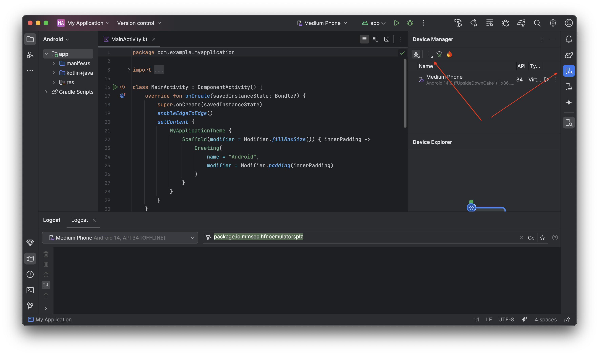

It opens this screen:
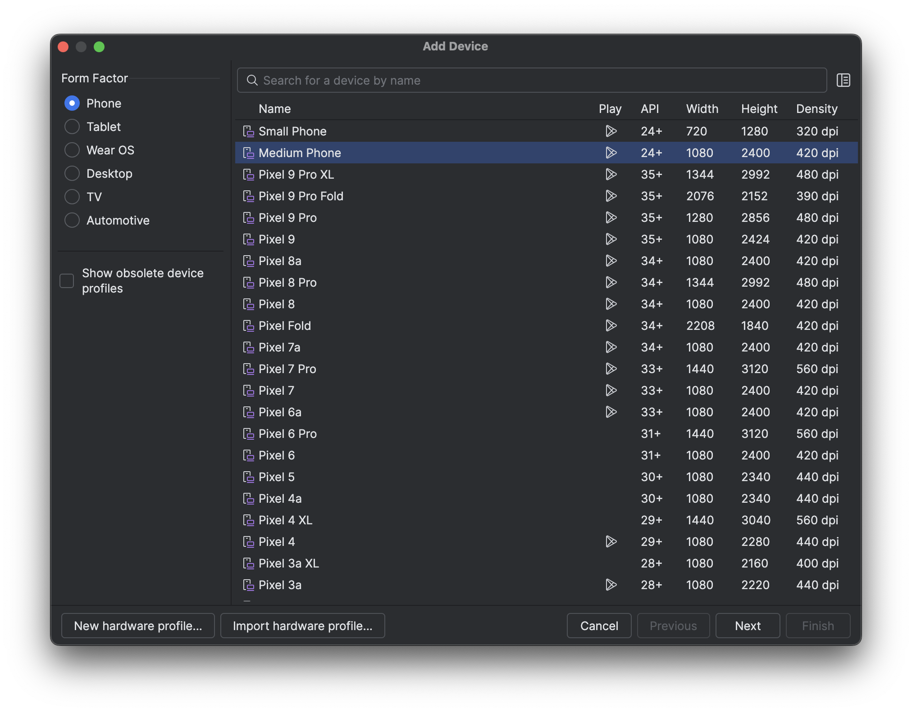

We select "Medium Phone" then click the "Next" button:
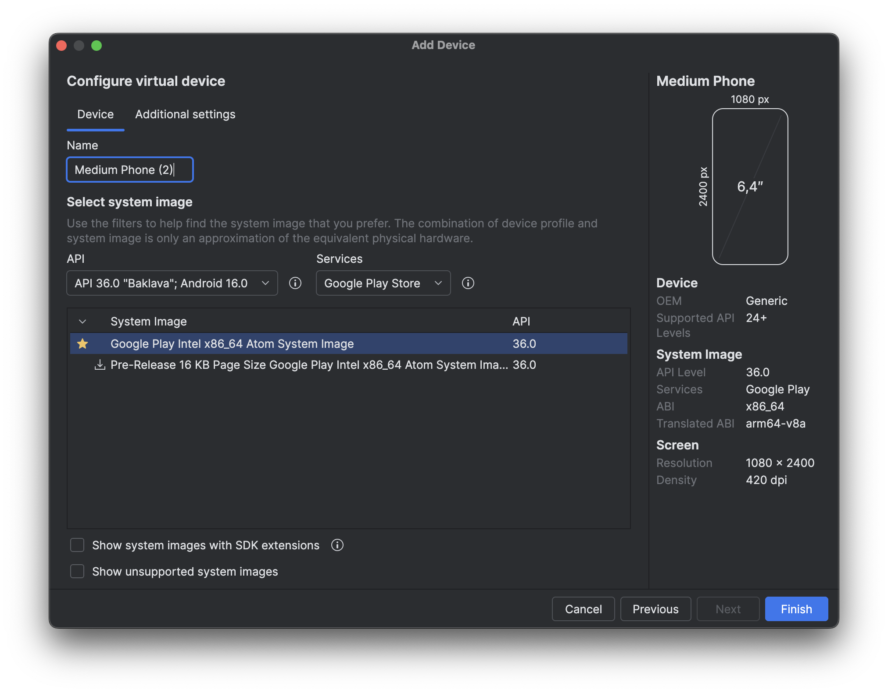

We go back to the `AndroidManifest.xml` and look for the target build SDK and we see this, close to the top of the file:
```xml
<uses-sdk
    android:minSdkVersion="24"
    android:targetSdkVersion="34"/>
```

Let's pick API 34 in the first select menu ("API"), then "Google APIs" in the "Services" select menu and click the "Finish" button:
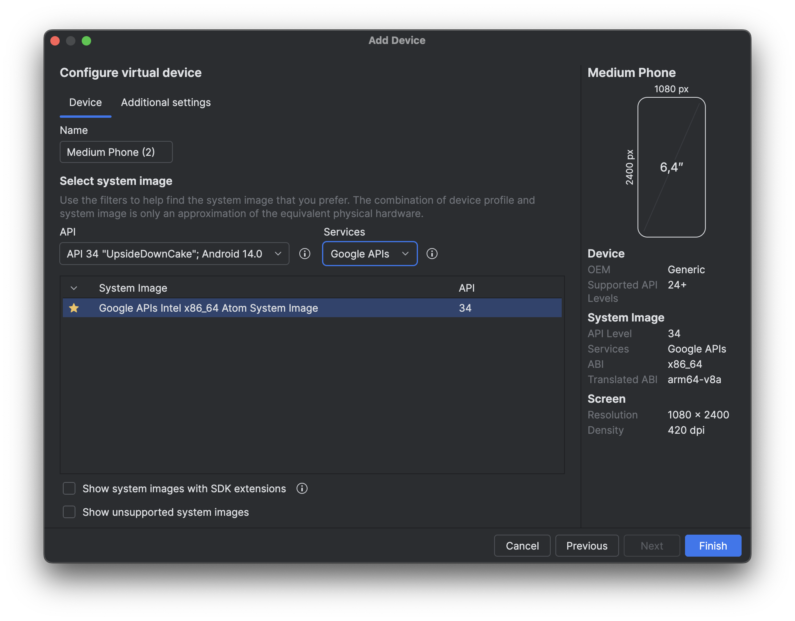

The necessary components should install and then you can see the device listed in the "Device Manager" section:
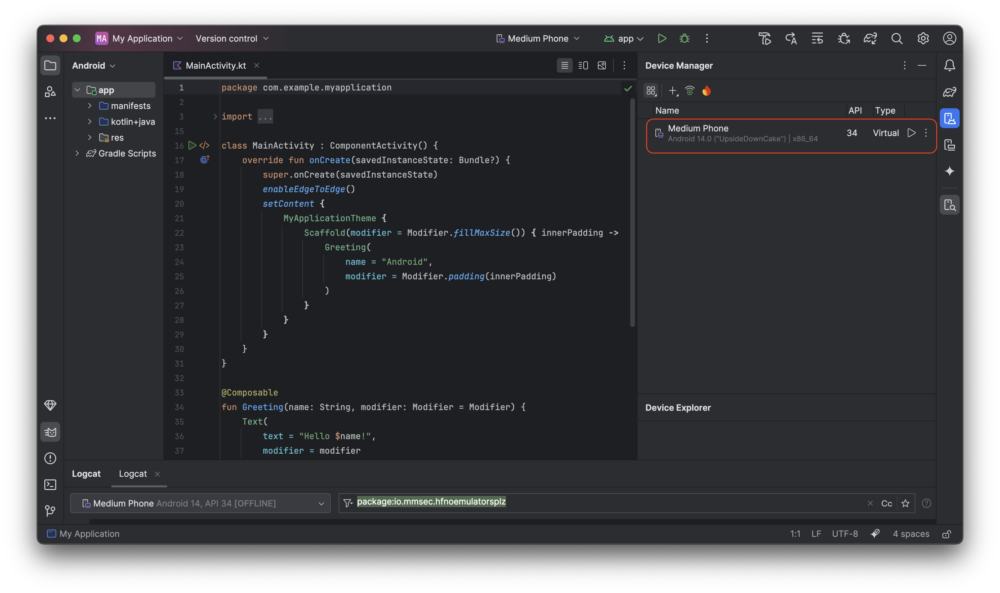

Click on the "Play" button to start the device and you're be taken to the "Running Devices" section on the right-hand side and you'll eventually see the device running. It will take some time to boot up and show the Android home screen:
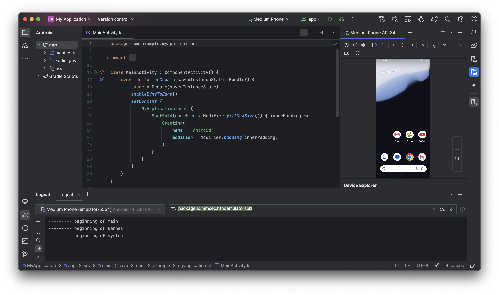

Next, we go into "Logcat" and adjust the filter to be able to see the application logs. We use this filter string which restricts the logs we'll see to the application we'll run. If you recall, we found `io.mmsec.hfnoemulatorsplz.MainActivity` as the entry point of the app and the `io.mmsec.hfnoemulatorsplz` part is the Java package of the app:
```
package:io.mmsec.hfnoemulatorsplz
```

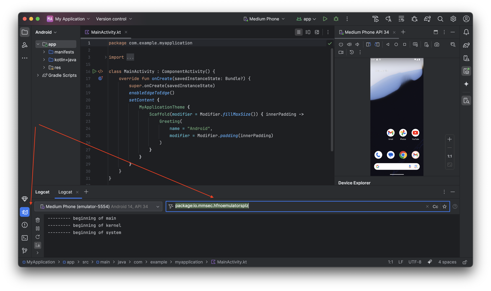

We're ready to install the app and play around with it.
```console
### Confirm that ADB can see the emulator
$ ~/Library/Android/sdk/platform-tools/adb devices
List of devices attached
emulator-5554	device
$

### Install the app
$ ~/Library/Android/sdk/platform-tools/adb install NoEmulatorsPlz.
Performing Streamed Install
Success
$
```

Following the installation of the app, going back to Android Studio, we can see the app's icon:
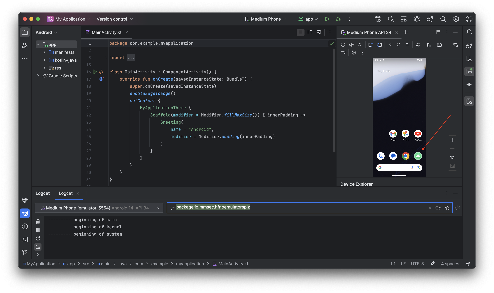

After starting the app, we see what we were expecting: the image with the Sentinel and a button:
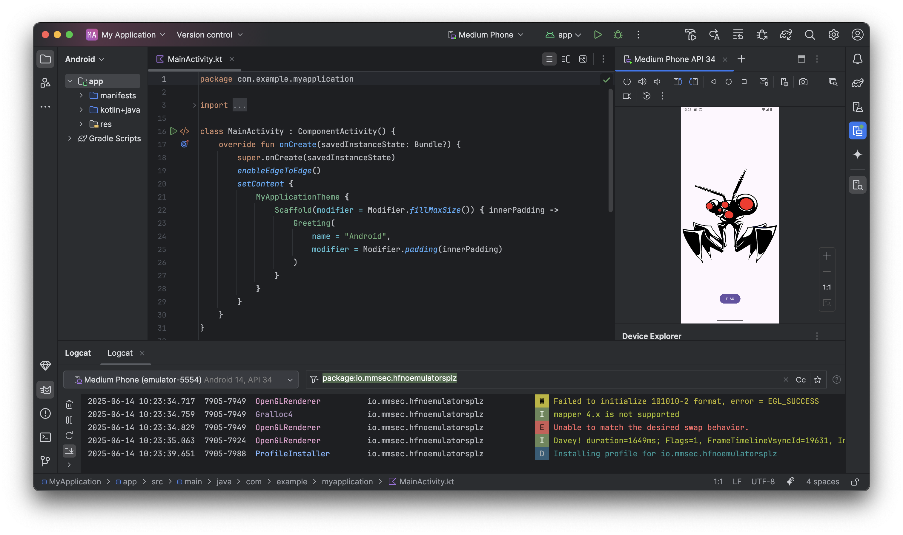
We also see the application logs flowing in "Logcat", at the bottom.

Next, we click on the "Flag" button to see what happens:
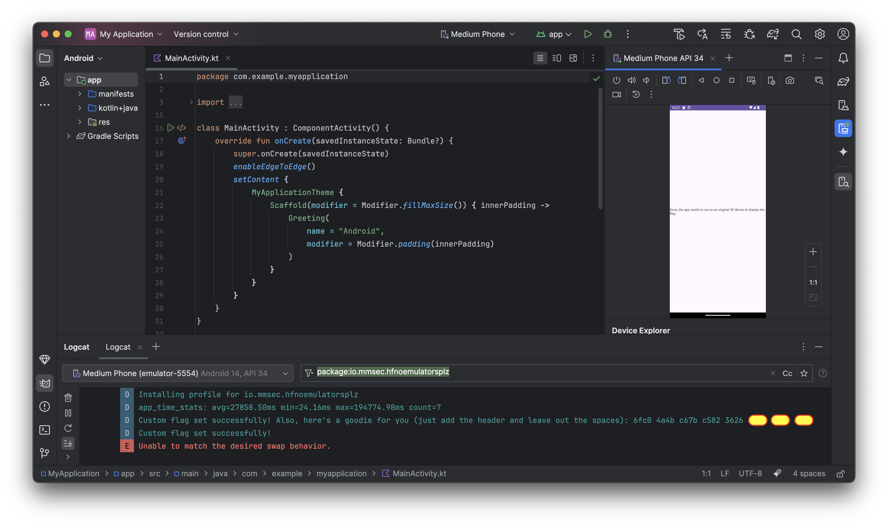

I scrolled the log window to the right to fully see the text. I also redacted the last part of the flag in case this challenge comes back in a later CTF to avoid making it too easy to submit the flag. Looking at the last interesting block of code from `FlagActivity`, we see that this line of code executed and produced the log file that provided us the first flag:
```java
Log.d("Custom flag properties", "Custom flag set successfully! " + ((Object) decodedText1));
```

We can also see this log line, proving the previous 2 lines of code ran:
```java
Log.d("Custom flag properties", "Custom flag set successfully!");
```

Finally, on the app screen, we're seeing this message: `Sorry, the app needs to run on an original HF device to display the flag.` which lines up with this code:
```java
if (Intrinsics.areEqual(isHFEmulator, "originalHFEmulator")) {
    textView.setText(String.valueOf(decodedText2));
} else {
    textView.setText("Sorry, the app needs to run on an original HF device to display the flag.");
}
```

Flag: `HF-6fc04a4bc67bc5823626<last 12 hex chars>`

### NoEmulatorsPlz 2 (200)

Challenge description:
```
This app only runs on original HF Devices! Flag 2/3
```

Picking up where we left the previous challenge, we have to find a way to set the `debug.customflag` variable to `originalHFEmulator` so that we can bypass this check:
```java
if (Intrinsics.areEqual(isHFEmulator, "originalHFEmulator")) {
    textView.setText(String.valueOf(decodedText2));
} else {
    textView.setText("Sorry, the app needs to run on an original HF device to display the flag.");
}
```

We'll use [Frida](https://frida.re/docs/android/) for this.

```console
### Install Frida
$ pip install frida-tools

### Verify Frida version
$ frida --version
17.0.7
$
```

Next, we need to install the matching `frida-server` binary to install in the emulator. We can download it from [here](https://github.com/frida/frida/releases/download/17.0.7/frida-server-17.0.7-android-x86_64.xz) and then we'll install it in the emulator and validate that it works.

```console
### Unpack and rename the file
$ unxz frida-server-17.0.7-android-x86_64.xz
$ mv frida-server-17.0.7-android-x86_64 frida-server

### Root the device
$ ~/Library/Android/sdk/platform-tools/adb root
restarting adbd as root

### Copy frida-server, start it and confirm that it is running
$ ~/Library/Android/sdk/platform-tools/adb push frida-server /data/local/tmp/
frida-server: 1 file pushed, 0 skipped. 181.8 MB/s (110692280 bytes in 0.581s)
$ ~/Library/Android/sdk/platform-tools/adb shell "chmod 755 /data/local/tmp/frida-server"
$ Library/Android/sdk/platform-tools/adb shell "/data/local/tmp/frida-server &"
<Ctrl-C>
$ ~/Library/Android/sdk/platform-tools/adb shell ps -A | grep frida-server
root          9786     1   10944708  43264 do_sys_poll         0 S frida-server

### Validate that frida-server works well
$ frida-ps -D emulator-5554
 PID  Name
----  ----------------------------------------------------------
4499   Chrome
8831   Contacts
8854   Gmail
2216   Google
7905   HFNoEmulatorsPlz
1612   SIM Toolkit
7374   Settings
9663      adbd
 184      android.hardware.atrace@1.0-service
[...]
```

With the help of ChatGPT, we get this script to intercept `System.getProperty("debug.customflag", "")` and we return the value `originalHFEmulator` to satisfy the "if" condition:
```javascript
// bypass_customflag.js
Java.perform(function () {
    var System = Java.use('java.lang.System');
    var Log = Java.use('android.util.Log');
    var TAG = "FridaBypassHF";

    console.log("Frida script loaded. Waiting to intercept System.getProperty...");

    System.getProperty.overload('java.lang.String', 'java.lang.String').implementation = function (key, def) {
        var jsKey = key.toString();

        if (jsKey === 'debug.customflag') {
            var originalValue = this.getProperty(key, def);

            Log.i(TAG, 'Intercepted System.getProperty("debug.customflag", "' + def + '")');
            Log.d(TAG, 'Original value for "debug.customflag" would have been: "' + originalValue + '"');
            Log.i(TAG, 'Returning "originalHFEmulator" instead.');
            console.log('[Frida] Intercepted System.getProperty("debug.customflag"). Original: "' + originalValue + '". Returning: "originalHFEmulator"');

            return "originalHFEmulator";
        }
        return this.getProperty(key, def);
    };
});
```

We run the script using `frida`:
```console
$ frida -U -f io.mmsec.hfnoemulatorsplz -l bypass_customflag.js
     ____
    / _  |   Frida 17.0.7 - A world-class dynamic instrumentation toolkit
   | (_| |
    > _  |   Commands:
   /_/ |_|       help      -> Displays the help system
   . . . .       object?   -> Display information about 'object'
   . . . .       exit/quit -> Exit
   . . . .
   . . . .   More info at https://frida.re/docs/home/
   . . . .
   . . . .   Connected to Android Emulator 5554 (id=emulator-5554)
Spawned `io.mmsec.hfnoemulatorsplz`. Resuming main thread!
[Android Emulator 5554::io.mmsec.hfnoemulatorsplz ]-> [Frida] Intercepted System.getProperty("debug.customflag"). Original: "". Returning: "originalHFEmulator"
[Android Emulator 5554::io.mmsec.hfnoemulatorsplz ]->
```

On the emulator, we need to click the "Flag" button and then we're seeing this which proves we fulfilled the condition and we have the second flag:
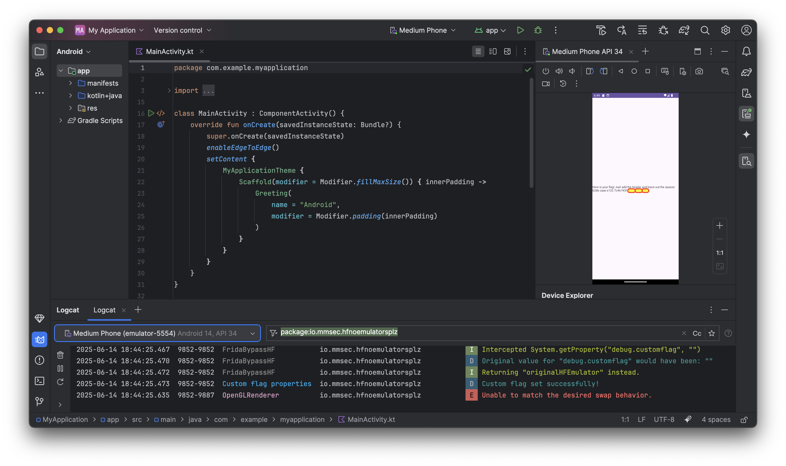

Flag: `HF-626bcaaee1227c46f43f<last 12 hex chars>`

### NoEmulatorsPlz 3 (200)

Challenge description:
```
This app only runs on original HF Devices! Flag 3/3
```

The last challenge is very similar to the previous one. This time, we have to intercept this function call:
```java
System.setProperty("debug.secretkey", String.valueOf(decodedText3))
```

Again, asking for ChatGPT's help to save some time and after cleaning up the script we end up with this code that has a little twist to print the output to the console where `frida` is running rather than in Logcat:
```javascript
// read_secretkey.js
Java.perform(function () {
    var System = Java.use('java.lang.System');

    System.setProperty.overload('java.lang.String', 'java.lang.String').implementation = function(key, value) {
        if (key === 'debug.secretkey') {
            console.log('[Frida] System.setProperty("debug.secretkey", "' + value + '")');
        }
        return this.setProperty(key, value);
    };
});
```

We then run `frida` with this script and click the "Flag" button in the app and we see this output:
```console
$ frida -U -f io.mmsec.hfnoemulatorsplz -l read_secretkey.js
     ____
    / _  |   Frida 17.0.7 - A world-class dynamic instrumentation toolkit
   | (_| |
    > _  |   Commands:
   /_/ |_|       help      -> Displays the help system
   . . . .       object?   -> Display information about 'object'
   . . . .       exit/quit -> Exit
   . . . .
   . . . .   More info at https://frida.re/docs/home/
   . . . .
   . . . .   Connected to Android Emulator 5554 (id=emulator-5554)
Spawned `io.mmsec.hfnoemulatorsplz`. Resuming main thread!
[Android Emulator 5554::io.mmsec.hfnoemulatorsplz ]-> [Frida] System.setProperty("debug.secretkey", "+header -spaces, you know the drill: 8352 db74 4d2e d50a cbaf <redacted> <redacted> <redacted>")
```

Flag: `HF-8352db744d2ed50acbaf<last 12 hex chars>`
